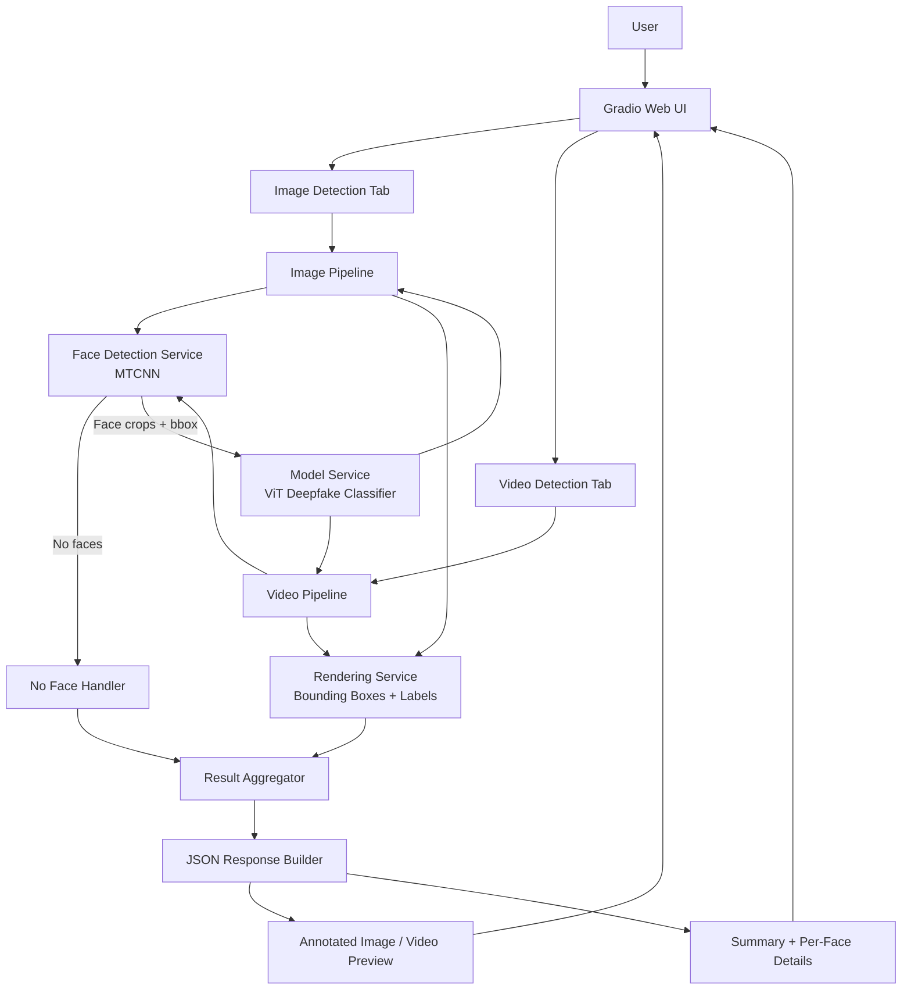
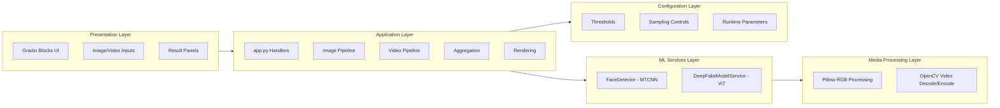
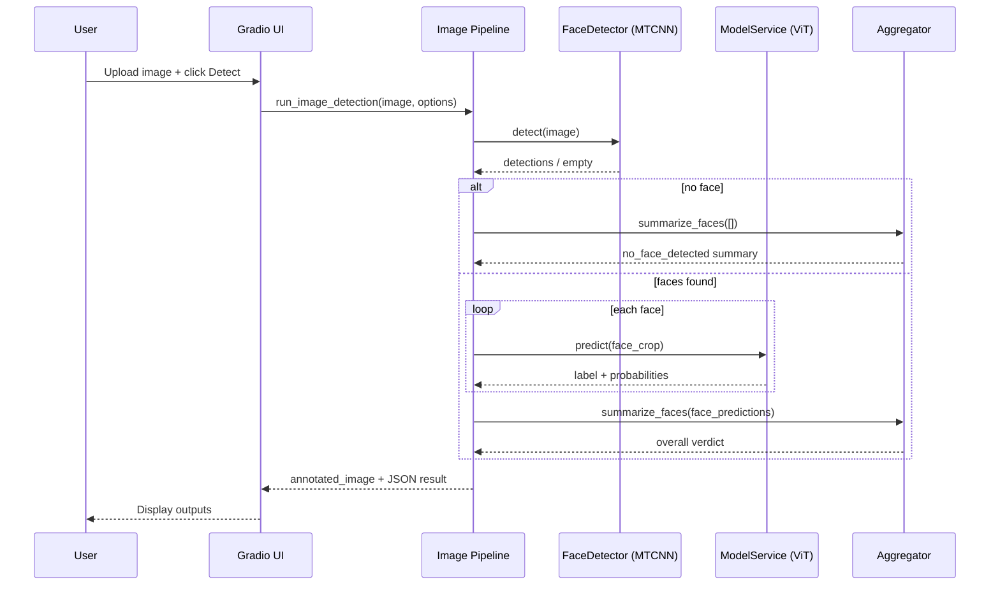
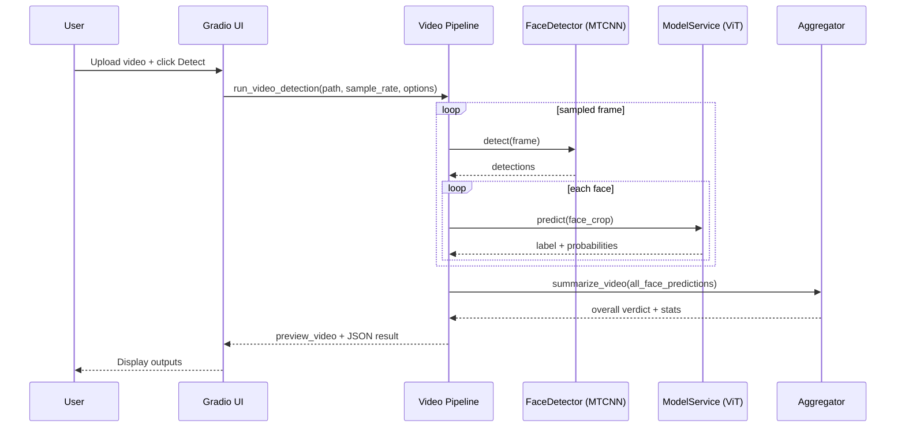

# Deepfake Detection System Architecture

## 1. High-Level Architecture

## 2. Layered View

## 3. Sequence (Image Request)

## 4. Sequence (Video Request)

## 5. Component Responsibilities

- `app.py`: UI events, input validation, output packaging.
- `src/face_service.py`: face detection, bbox clipping, confidence filtering.
- `src/model_service.py`: lazy model load, inference, probability outputs.
- `src/image_pipeline.py`: single-image end-to-end flow.
- `src/video_pipeline.py`: sampled-frame video flow and preview build.
- `src/rendering.py`: draw labels and face boxes.
- `src/aggregation.py`: no-face handling and final decision logic.
- `src/config.py`: thresholds, sampling, and runtime constants.

## 6. Data Contracts

### Face Prediction Item

- `bbox`: [x1, y1, x2, y2]
- `face_confidence`: float
- `predicted_label`: string
- `label_confidence`: float
- `deepfake_probability`: float
- `realism_probability`: float

### Summary Object

- `status`: ok | no_face_detected | error
- `overall_label`: Deepfake | Realism | No face detected
- `total_faces`: int
- `fake_faces`: int
- `max_deepfake_probability`: float
- `average_deepfake_probability`: float
